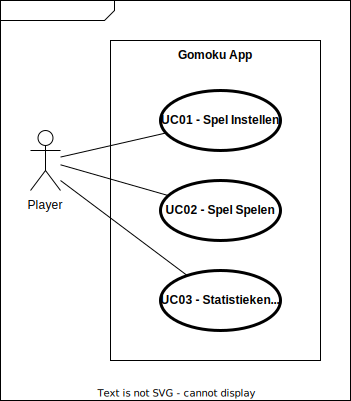
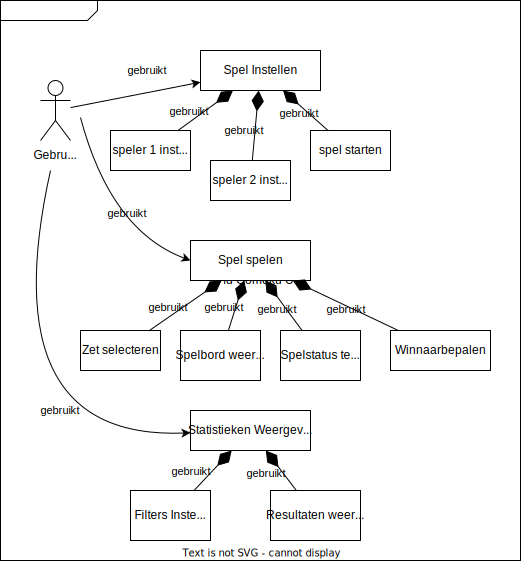
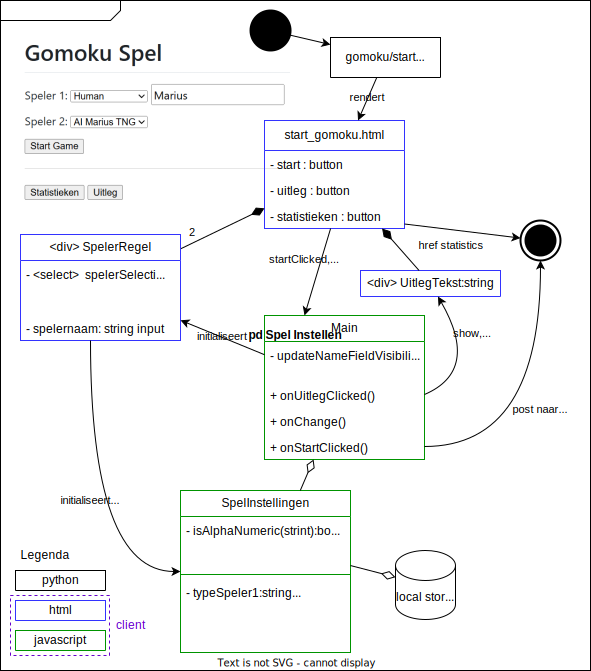

# Gomoku UI Design
## Ontwerpflow
Voor het ontwerp van de WebApp is de volgende ontwerpflow gebruikt:
- Usecasebeschrijvingen en Usecasediagram ontwerpen.
- Functionele decompositie ontwerpen
- Op basis daarvan agile/cyclisch de code voor de bijbehorende pagina's schrijven. Begin met iets. Steeds iets erbij.
- Per webpagina een "Page Design" model up to date houden, welke helpt om het overzicht van wat je maakt te behouden.

## Achtergrond

Tijdens onze opleiding is er een deelopdracht waar je zelf een web applicatie moet hosten of waar je zelf een zo goed mogelijke AI voor het spel "gomoku" schrijft (dwz: een ai voor een 5 op een rij spel op een 19x19 go bord).

Om het mogelijk te maken die ai's tegen elkaar te laten spelen, bieden gomoku-backends een gestandaardiseerde api-interface die via python als volgt aangeroepen kan worden:

```
 dic={}
        dic['board']=self.convertToList(gamestate[0])       # lists can be json serialised, opposed to numpy arrays,therefore convert first.
        dic['ply']=gamestate[1]
        dic['last_move']=self.convertToIntTuple(last_move)  # (int8,int8) cannot properly be json serialised
        dic['max_time_to_move']=max_time_for_server_script
        dic['winningSeries']=self.winningSeries
        dic['boardSize']=self.boardSize
        dic['black']=self.black

        # measure the time spent
        # start_time_ns = time.time_ns()

        # Voor debugging: even spieken hoe de straks verstuurde JSON-data er als tekst uitziet.
        # json_data = json.dumps(dic)
        # print(f"Verzonden JSON-data: {json_data}")

        # call the server using POST, passing the dic as json.
        #url = 'https://themave.pythonanywhere.com/make_gomoku_move/ai_marius_tng'
        url = 'https://www.pikido.com/gomoku/make_gomoku_move/ai_marius_tng'
        req = requests.post(url, json = dic)
```

Kortom, er wordt een json gepost met de huidige status van het bord:
Klein (19x19 is eigenlijk gebruikelijk voor gomoku) voorbeeld, voor een 5x5 board van zo'n json body content:

```
{"board": [[2, 0, 0, 0, 0], [0, 0, 0, 1, 0], [0, 0, 0, 0, 0], [0, 0, 0, 0, 0], [0, 0, 0, 0, 0]], "ply": 3, "last_move": [1, 3], "max_time_to_move": 400, "winningSeries": 5, "boardSize": 5, "black": true}
```

Toelichting:

- board = array van array van gehele getallen, welke de rijen en kolommen van het speelbord representeren.

- De nummers kunnen 0, 1 en 2 zijn:
  
  - 0 : leeg veld
  - 1 : witte steen
  - 2 : zwarte steen

- ply : het "nummer van de zet" welke nog gespeeld moet worden. ply=1 zegt tegen de API: wat zet jij als eerste zet van het spel?

- last_move : [rij,kolom] van de laatste move (voorafgaand aan de move die de AI moet bedenken).

- max_time_to_move : maximale tijd in milliseconden die de server mag besteden aan het bedenken van de zet. NB: als de server ver weg staat, kun je daar bovenop ook nog significant tijd kwijt zin aan latency.

- winningSeries : het aantal stenen op een rij dat winst oplevert. Normaalgesproken 5.

- boardSize : de breedte en hoogte van het vierkante speelbord, in vakjes. Voor gomoku is dat normaal gesproken 19.

- black : boolean 
  
  - true betekent dat de AI speelt met "zwart", met stenen die op het spelbord door het getal 2 vertegenwoordigd worden
  - false betekent dat de AI speelt met "wit", met stenen die op het spelbord door het getal 1 vertegenwoordigd worden

# Use Case Diagram

Onderstaand is een Use Case Diagram te zien voor het spel.



# Use Case Beschrijvingen

<table border="1">
  <thead>
    <tr>
      <th>Naam</th>
      <th>UC01 - Spel Instellen</th>
    </tr>
  </thead>
  <tbody>
    <tr>
      <td>Preconditie</td>
      <td>Er is gebrowsed naar de main-url van het spel gebrowsed, of er is na een spel (zie use case "Spel Spelen") gekozen om een nieuw spel te spelen.</td>
    </tr>
    <tr>
      <td>Postconditie</td>
      <td>De use case "Spel Spelen" wordt uitgevoerd.</td>
    </tr>
    <tr>
      <td>Scenario</td>
      <td>1. Het (start-)scherm toont voor speler 1 (zwart) en speler 2 (wit) een dropdownbox en een knop "Start".<br>  2. De gebruiker kiest bij de eerste dropdownbox: "mens" en bij de tweede "AI".<br> 3. Vervolgens drukt hij op de knop "Start".<br> 4. De dropdownboxen en startknop verdwijnen en het spel start (zie use case "Spel Spelen")</td>
    </tr>
  </tbody>
</table>

<table border="1">
  <thead>
    <tr>
      <th>Naam</th>
      <th>UC02 - Spel Spelen</th>
    </tr>
  </thead>
  <tbody>
    <tr>
      <td>Preconditie</td>
      <td>Vanuit de use case "Spel Instellen" is het spel gestart.</td>
    </tr>
    <tr>
      <td>Postconditie</td>
      <td>Er is teruggekeerd naar de use case "Spel Instellen".</td>
    </tr>
    <tr>
      <td>Scenario</td>
      <td>1. De dropdownboxen en startknop verdwijnen en het spelbord verschijnt. <br>2. Onder het bord verschijnt de tekst "zwart (mens)" is aan zet.<br>3. De gebruiker klikt op een leeg veld op het bord. Op die plek verschijnt een zwarte steen.<br>4. Onder het bord verschijnt de tekst "wit (AI)" is aan zet.<br>5. Even later wordt de zet van de AI, een witte steen, op een tot dusver leeg veld van het bord toegevoegd. <br>6. goto 2.</td>
    </tr>
    <tr>
      <td>Invariant</td>
      <td>Na elke zet wordt gecontroleerd of er een winnaar is. Zodra dat het geval is, wordt dat onder het bord de winnaar vermeld, bijvoorbeeld "zwart (AI) is de winnaar". Verder verschijnt er een knop "Nieuw Spel". Zodra daarop wordt gedrukt, eindigt deze use case en start use case "Spel Instellen".</td>
    </tr>
  </tbody>
</table>

<table border="1">
  <thead>
    <tr>
      <th>Naam</th>
      <th>UC03 - Statistieken Weergeven</th>
    </tr>
  </thead>
  <tbody>
    <tr>
      <td>Preconditie</td>
      <td>Er is vanuit de main-url van het spel gebrowsed naar de pagina "Statistieken".</td>
    </tr>
    <tr>
      <td>Scenario</td>
      <td>Het statistieken-scherm wordt getoond:<br> 
      - Een dropdownbox die de ai van de zwarte speler kiest [Human, AI Random, AI Marius TNG] <br>  - een dropdownbox [EN,OF].<br> - Een dropdownbox die de ai van de witte speler kiest [Human, AI Random, AI Marius TNG].<br> - Een button "Toon resultaten".<br> - Een button "Nieuw Spel".<br> <br>1. De gebruiker kiest "AI Random", "EN", "Human".<br>  2. Hij drukt op "Toon Resultaten". <br> 3. De tabel met wedstrijdresultaten verschijnt, waarbij de zwarte speler de "random AI" was en tegelijkertijd de witte speler een mens was. <br>Bij elk resultaat wordt de naam van de zwarte en witte speler getoond, het aantal zetten dat het spelletje duurde en het tijdstip dat het spelletje uitgepeeld werd. </td>
    </tr>
  </tbody>
</table>

# Functionele Decompositie
Onderstaand is een Functionele Decompositie te vinden van de WebApp.


# Page Designs
Onderstaand zijn wat ik noem "Page Designs" te vinden. Daarmee bedoel ik een model per webpagina die je in je browser kunt bezoeken. Het laat zien hoe de structuur van de pagina (de HTML), het client-side dynamische gedrag (de Javascript), het server-side dynamische gedrag (de Flask endpoints) en de Mongo Database met elkaar samenwerken. Het is een voor dit type WebApps adhoc verzonnen modelleringsmethode, welke intuitief zou moeten overkomen als je bekend bent met functionele decomposities, klassediagarammen en activitydiagrammen. Maar goed, geen officieel UML of SysML dus.

## Page Design voor Spel Instellen

## Page Design voor Spel Spelen

## Page Design voor Statistieken Weergeven
